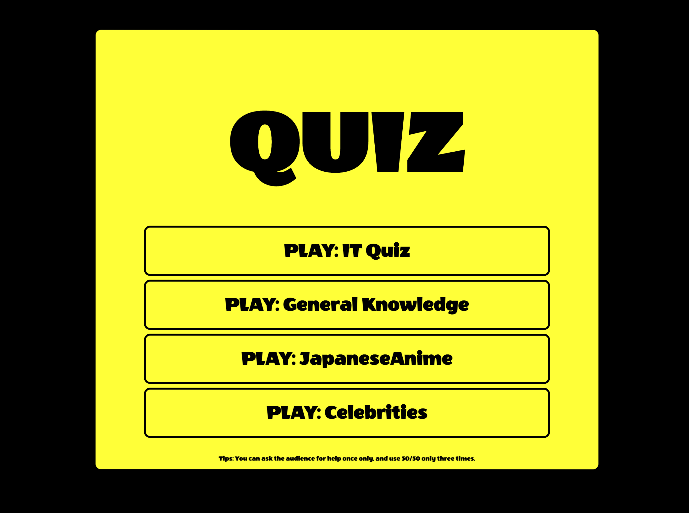
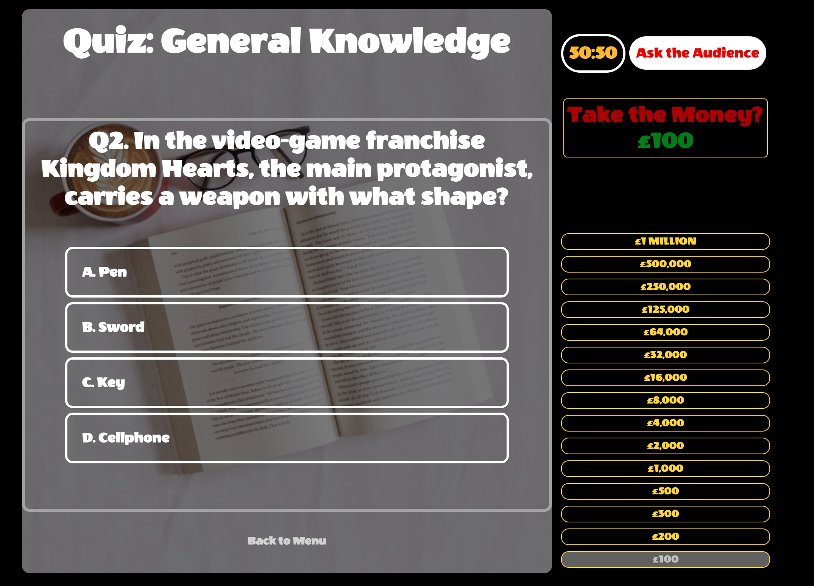
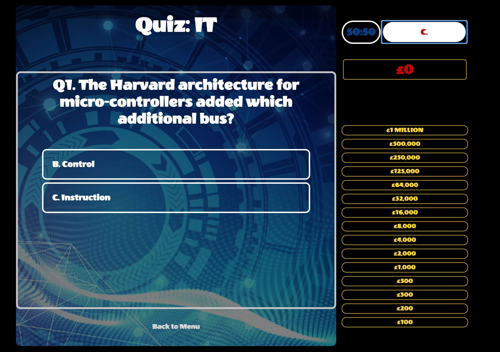
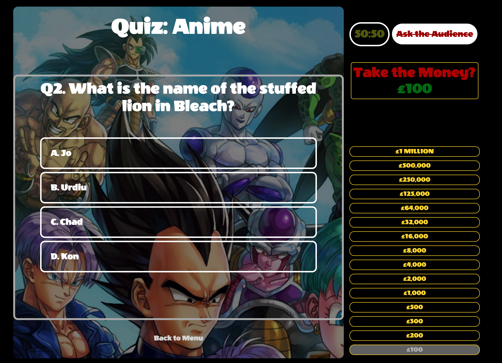
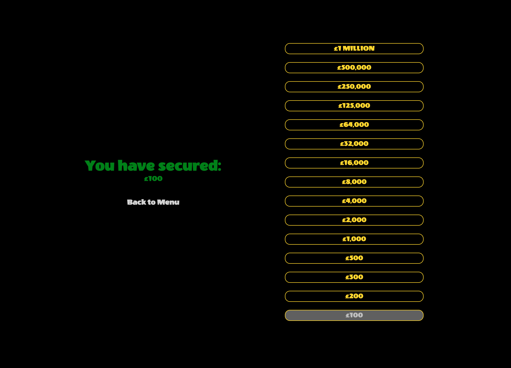
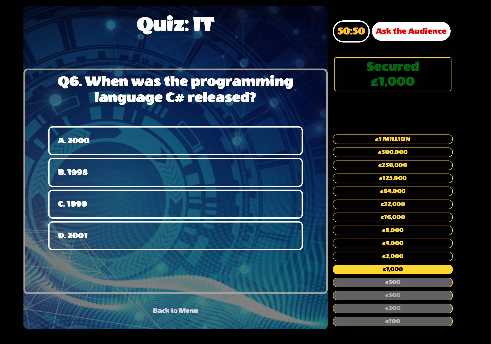
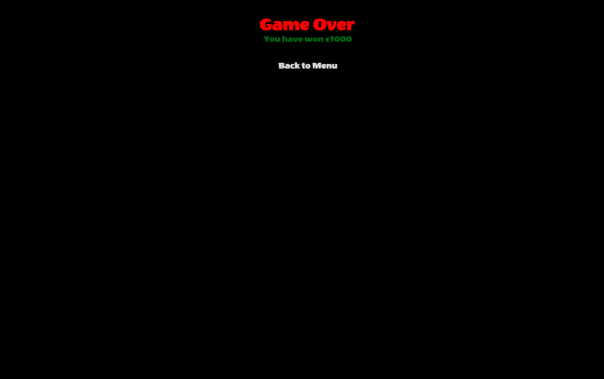

# Project 2: Quiz

## Index

* [Overview](#Overview)
* [Brief](#Brief)
* [Technologies Used](#Technologies-Used)
* [Approach](#Approach)
    * [Layout](#Layout)
* [The Components of the System](#The-Components-of-the-System)
    * [The Menu](#The-Menu)
    * [The Layout](#The-Layout)
    * [Categories Questions and Multiple Choices](#Categories-Questions-and-Multiple-Choices)
        * [Re-arranging & randomising the correct choice and incorrect choices](#Re-arranging-&-randomising-the-correct-choice-and-incorrect-choices)
    * [Alerting the Player: Right or Wrong](#Alerting-the-Player-Right-or-Wrong)
    * [Life Line: 5050](#Life-Line-5050)
    * [Life Line: Ask the audience](#Life-Line-Ask-the-audience)
    * [The MoneyBoard](#The-MoneyBoard)
    * [Notable Bugs & Fixes](#Notable-Bugs-&-Fixes)
    * [Wins and Challenges](#Wins-and-Challenges)
        * [Wins](#Wins)
        * [Challenges](#Challenges)
    * [Key Learnings](#Key-Learnings)
* [Play the game](#Play-the-game)

## Overview

This was the second project at General Assembly. It was a solo project conducted just under 48 hours. For this project, I had a chance to create my very first react application after learning React Hooks. I chose to make a Quiz with four categories: Information Technology, General Knowledge, Anime & Celebrities. The Quiz follows a similar system to the very famous, "Who Wants to Be a Millionaire" TV show, except it could not be possible to include the famous life line, "Phone a Friend". 

## Brief 

- To create a web application using React in 48 hours, having at least one third-party API. 

## Technologies Used

- JavaScript (ES6)
- React
- HTML5
- CSS3
- Insomnia
- Git
- GitHub
- Google Fonts
- Google Chrome dev tools
- VS Code
- Eslint

## Approach

From the set-go a quiz application is what I had in mind. I initially broke down the requirements of a quiz application, taking inspiration from "Who Wants To Be A Millionaire". I broke down my quiz application to essentially these parts: the layout, categories, questions & choices, life-lines and the money-board. All these together would essentially be parts which make up the system. How the system operates was another aspect I had to think about, and in the end, I near explictly emulated it somewhat near to the show. Furthermore, I had to think carefully What I wanted the caregories to be, the question & choices, and where/what third party API would be best to use. 

### Layout

Before going into depth of the parts, I underwent a rough sketch using pencil and paper as I thought PhotoShop would not be needed for the scope of this application. 

## The Components of the System 

### The Menu

The application starts with the menu. The user essentially has four categories to choose from: Information Technology, General Knowledge, Anime and Celebrities. 

<p align="center">
  
</p>

### The Layout

<p align="center">
  
</p>

Once the user selects the category from the menu bar, he/she will be directed to the main aspect of the game. Here, the question appears on the left side along with the question and multiple choices. The moneyboard appears on the bottom right expanding to the top, and the life-lines appear to the very top of that column. I thought given this layout, the user would be able to see constantly what their current money bracket is at, and how many life lines they essentially have left. 

### Categories, Questions and Multiple Choices

```
        <Link to={{ pathname: '/game', state: 'IT' }}>
          <h1 className="categories">PLAY: Information Technology</h1>
        </Link>  
```

Any category that is chosen, the page navigates to the game component, and this is actually the same component for all four categories. The data that is pulled depends on the category the player chooses. To achieve all of this, I used `Link` and set a `state` within the `to=` bracket, this allows `state` to be accessed on the next component set in `pathname`. 

```
  if (state === 'IT') {
    baseUrl = 'https://opentdb.com/api.php?amount=50&category=18&type=multiple'
    quizTitle = 'IT'
    header = 'IT_header'
    textFormat = 'IT_text'
    borderChoice = 'ITchoice'
  } else if (state === 'generalKnowledge') {
    baseUrl = 'https://opentdb.com/api.php?amount=50&category=9&type=multiple'
    quizTitle = 'General Knowledge'
    header = 'general_header'
    textFormat = 'IT_text'
    borderChoice = 'ITchoice'
  } else if (state === 'anime') {
    baseUrl = 'https://opentdb.com/api.php?amount=30&category=31'
    quizTitle = 'Anime'
    header = 'anime_header'
    textFormat = 'anime_text'
    borderChoice = 'anime_choice'
  } else if (state === 'celebrities') {
    baseUrl = 'https://opentdb.com/api.php?amount=30&category=26&type=multiple'
    quizTitle = 'Celebrities'
    header = 'celeb_header'
    textFormat = 'celeb_text'
    borderChoice = 'celeb_choice'
  }
```

If state is set to 'General Knowledge', then only the General Knolwedge Link API would be used to pull in the data. For the quiz data, I decided to go with a third party provider, www.opentdb.com, known for their Trivia APIs. 

```
  React.useEffect(() => {
    const getData = async () => {
      try {
        const { data } = await axios.get(baseUrl)
        setQuizzes(data.results)
        setRandomNumber(Math.floor(Math.random() * 4))
        randomiseIncorrectChoices()
      } catch (err) {
        console.log(err)
      }
    }
    getData()
  }, [])

```

The API url pulls in 50 objects in an array. Each object has key-value pairs of category, correct_answer, difficulty, incorrect_answers (in an array), question and type. I was unable to decide how the API (object) was structured, so I came up what I thought was the most appropriate way to handle the data for what I wanted to use it for.


The key things I wanted from a quiz application were as followed. Firstly, I wanted the player to have the ability to see only one question, including its choices, only one per time. Secondly, I wanted the player to only see the next question and choices only if he/she answered correctly. On this point, I did not want the user to have to click "next" or something to go to the next question, I wanted it to be clean and automatic. Given these thoughts, I decided the best way to achieve this was to use the following code:

`quizzes[nextQuestion].question`

A question and its choices can only be displayed at once each time because of the way the API was structured: The data is stored in an array, each data being an object of key-values. I can essentially call each data indepdently by using state. For example, If I wanted the first question of the 50 objects that are pulled in, I can select the object `quizzes` and choose the first set simply using `quizzes[nextQuestion]` as nextQuestion is assigned to 0 (meaning the first in the array. ) Because the Array is 50, and each item in the array is an object, I can essentially call each item as I choose using this method. Because I essentially wanted the next question and choices to display after a player answers correctly, this was simply done by just adding `quizzes[nextQuestion + 1]`, which would give me the next data in the array. 

#### Re-arranging & randomising the correct choice and incorrect choices

```
 "results": [
    {
      "category": "Science: Computers",
      "type": "multiple",
      "difficulty": "easy",
      "question": "In any programming language, what is the most common way to iterate through an array?",
      "correct_answer": "&#039;For&#039; loops",
      "incorrect_answers": [
        "&#039;If&#039; Statements",
        "&#039;Do-while&#039; loops",
        "&#039;While&#039; loops"
      ]
    },
```

To understand how exactly I was able to randmoise the choice and incorrect choices, we must look at the API object structure. The `correct_answer` appears as one key-value pair, and the `incorrect_answers` appear as a key-value to an array of three item strings of the incorrect answers. There are three items in the array. Bearing this in mind, I decided best to structure the JSX like this:

```
  const randomChoiceCombination = () => {
    return (
      <>
        <h3>Q{nextQuestion + 1}. {quizzes[nextQuestion].question.replace(/&#039;|&quot;/g, function(matched){
          return badData[matched]
        })}</h3>

        { randomNumber === 0 ? correctAnswerChoicePlacePosition('A.') : null}

        { quizzes[nextQuestion].incorrect_answers[incorrectChoiceOrderOne] ? 
          <>
            {fiftyFiftyActive && positionOneFiftyFifty ? null : <h4 
              id={`${borderChoice}`} 
              data-id='wrong' 
              onClick={handleClick} 
              className='choice'> 
              {positionOne} {quizzes[nextQuestion].incorrect_answers[incorrectChoiceOrderOne].replace(/&#039;|&quot;/g, function(matched){
                return badData[matched]
              })}</h4>}
          </>
          : null }

        { randomNumber === 1 ? correctAnswerChoicePlacePosition('B.') : null}

        { quizzes[nextQuestion].incorrect_answers[incorrectChoiceOrderTwo] ?
          <>  
            {fiftyFiftyActive && positionTwoFiftyFifty ? null : <h4 
              id={`${borderChoice}`} 
              data-id='wrong' 
              onClick={handleClick} 
              className='choice'> 
              {positionTwo} {quizzes[nextQuestion].incorrect_answers[incorrectChoiceOrderTwo].replace(/&#039;|&quot;/g, function(matched){
                return badData[matched]
              })}</h4>}
          </>
          : null }

        { randomNumber === 2 ? correctAnswerChoicePlacePosition('C.') : null}

        { quizzes[nextQuestion].incorrect_answers[incorrectChoiceOrderThree] ? 
          <>
            {fiftyFiftyActive && positionThreeFiftyFifty ? null : <h4
              id={`${borderChoice}`}
              data-id='wrong'
              onClick={handleClick} 
              className='choice'> 
              {positionThree} {quizzes[nextQuestion].incorrect_answers[incorrectChoiceOrderThree].replace(/&#039;|&quot;/g, function(matched){
                return badData[matched]
              })}</h4>}
          </>
          : null }
         
        { randomNumber === 3 ? correctAnswerChoicePlacePosition('D.') : null}

      </>
    )
  }

```

The correct answer, `correctAnswerChoicePlacePosition`, choice can appear at four different positions depending on a random generator from 0 to 4. The incorrectChoices, `incorrectChoiceOrderOne` and so on, are also randomly generated from 0,1,2. To stop each variable from having the same number, the following code is used:

```
  function randomNumberGeneratorForWrongOrder() {
    const randomNo = Math.floor(Math.random() * 3)
    return randomNo
  }

  function randomiseIncorrectChoices() {

    while ((choiceOrderOne === choiceOrderTwo || choiceOrderOne === choiceOrderThree) || (choiceOrderTwo === choiceOrderOne || choiceOrderTwo === choiceOrderThree) || (choiceOrderThree === choiceOrderOne || choiceOrderThree === choiceOrderTwo)) {
      choiceOrderOne = randomNumberGeneratorForWrongOrder()
      choiceOrderTwo = randomNumberGeneratorForWrongOrder()
      choiceOrderThree = randomNumberGeneratorForWrongOrder()
    }

    setIncorrectChoiceOrderOne(choiceOrderOne)
    setIncorrectChoiceOrderTwo(choiceOrderTwo)
    setIncorrectChoiceOrderThree(choiceOrderThree)
  }

```

Using a while loop essentially all distinct numbers will be generated and then set in state. 


## Alerting the Player: Right or Wrong

Each Player will be notified every time they answered correctly, as the question choice they picked, the element would either go green or red. This was achieved by using `React.useRef` on the correct choice, and `event target` for the wrong choice.

```
  function handleClick(event) {

    if (playerAlreadyChose) return 
    
    const checkWin = event.target.dataset.id

    if (checkWin === 'wrong') {
      playerAlreadyChose = true
      event.target.style.backgroundColor = 'red'
      setTimeout(showCorrectAnswer, 1000)
      setTimeout(gameOver, 3000)
    } else if (checkWin === 'correct' ) {
      playerAlreadyChose = true
      answerChoice.current.style.backgroundColor = 'green'
      
      if (moneyboard === 14) {
        setJackpotReached(true)
        setMoneyboard(moneyboard + 1)
        return
      }
      setTimeout(normalMode, 1000)
    }
  }

```

If player chooses correctly, they will advance to the next set of question and answers. The code also prevents players from changing their mind after they choose wrongly: `playerAlreadyChose`. 

## Life Line: 5050

<p align="center">
  
</p>

If the player ever finds themselves to be struggling on a question, the player can essentially choose two life lines: 50:50, Ask the Audience. If the player chooses, 50:50, then the system will, out of four choices, remove two incorrect choices leaving one incorrect answer and one correct answer remaining. This, ofcourse, will slightly increase the chances of the player choosing the right answer. To achieve this, the following code was used: 

```
  function handleClickFifty() {
    if (!quizzes[nextQuestion].incorrect_answers[1] || !quizzes[nextQuestion].incorrect_answers[2]) return
    if (!fiftyFiftyCount >= 1) return

    function randomGen() {
      return Math.floor(Math.random() * 3)
    }

    const randomNumberOne = randomGen()
    let randomNumberTwo = randomGen()

    while (randomNumberTwo === randomNumberOne) {
      randomNumberTwo = randomGen()
    }

    if (randomNumberOne === 0) {
      SetPositionOneFiftyFifty(true)
    } else if (randomNumberOne === 1) {
      SetPositionTwoFiftyFifty(true)
    } else if (randomNumberOne === 2) {
      SetPositionThreeFiftyFifty(true)
    }

    if (randomNumberTwo === 0) {
      SetPositionOneFiftyFifty(true)
    } else if (randomNumberTwo === 1) {
      SetPositionTwoFiftyFifty(true)
    } else if (randomNumberTwo === 2) {
      SetPositionThreeFiftyFifty(true)
    }

    setFiftyFiftyCount(fiftyFiftyCount - 1)
    setFiftyFiftyActive(true)
    
    fifty.current.style.textDecoration = 'line-through'
  } 
```

As mentioned before, not all apis have 4 choices, some only have two choices: one correct choice and one incorrect choice. Therefore, the code prevents 5050 from being used if more than one incorrect answer is present. The code also prevents 5050 from being used more than once. 

In order to select which two incorrect choices are removed, a random generator and a while loop are used to generate two distinct numbers that are used to set a position in a state of true e.g. `positionTwoFiftyFifty`. Once the appropriate variable is active, the `fiftyfiftyActive` variable becomes active, these two variable together remove two incorrect choices from the JSX, displaying one correct answer and one incorrect answer. 

```
        { quizzes[nextQuestion].incorrect_answers[incorrectChoiceOrderTwo] ?
          <>  
            {fiftyFiftyActive && positionTwoFiftyFifty ? null : <h4 
              id={`${borderChoice}`} 
              data-id='wrong' 
              onClick={handleClick} 
              className='choice'> 
              {positionTwo} {quizzes[nextQuestion].incorrect_answers[incorrectChoiceOrderTwo].replace(/&#039;|&quot;/g, function(matched){
                return badData[matched]
              })}</h4>}
          </>
          : null }
```

## Life Line: Ask the audience

A player can also choose to ask the audience once. The audience will provide the corresponding letter which holds the right answer. 

```
function askAudience(e) {
    if (audienceCount >= 1) {
      e.target.innerHTML = askAudienceLetter
      setAudienceCount(audienceCount - 1)
      setTimeout(function () {
        e.target.innerText = 'Ask the Audience'
        e.target.style.textDecoration = 'line-through'
      }, 5000)
    } 
  }
```

A player can only ask the audience once, the audience's HTML changes to the corresponding Letter which contains the answer e.g. A. , B. , C. , D.  

## The MoneyBoard

There are 15 money brackets on the moneyboard. Every time a question is answered correctly, the money bracket moves up by one. In order to achieve this for every win the variable `moneyboard` has 1 added to it, each number of the moneyboard then reflects the current amount of money the player is on. A player can choose to take whatever money bracket they are on. 


```
  function moneyTaken() {
    switch (moneyboard) {
      case 0:
        return '£0'
      case 1:
        return '£100'
      case 2:
        return '£200'
      case 3:
        return '£300'
      case 4:
        return '£500'
      case 5:
        return '£1,000'
      case 6:
        return '£2,000'
      case 7:
        return '£4,000'
      case 8:
        return '£8,000'
      case 9:
        return '£16,000'
      case 10:
        return '£32,000'
      case 11:
        return '£64,000'
      case 12:
        return '£125,000'
      case 13:
        return '£250,000'
      case 14:
        return '£500,000'
      case 15:
        return '£1 MILLION'
    }
  }
```

<p align="center">
  
  
</p>

However, if they do not choose to take the money generated from the question answered correcntly before, and decide to answer the question instead, and this happens to be wrong, they will drop to the nearest secure point mentioned below. If no secure point is reached they drop to the lowest money bracket which is £0 - They Win nothing. 

Like the quiz show, every five questions answered correctly, secures you an amount of money (secure point) despite getting the next question(s) wrong. The secure points will are £1000, £32000, and ofcourse, £1 Million. 

<p align="center">
  
</p>


However, failing to answer the question correctly, and failing to take the money before answering a question correctly drops the player's money down to the lowest secure point secured: If the moneyboard is less than 5 the player will win nothing, if the money board is between 5 and 10, the player will win £1000, if the moneyboard is between 10 to 14 the lowest secure point is £32,000. 

<p align="center">
  
</p>


```
  function checkPrizeMoney() {
    if (moneyboard < 5) {
      return <span className='won_nothing'>{'You have won nothing'}</span>
    } else if (moneyboard >= 5 && moneyboard < 10) {
      return <span className='won_1000'>{'You have won £1000'}</span>
    } else if (moneyboard >= 10 && moneyboard < 15) {
      return <span className='won_32000'>{'You have won £32,000'}</span>
    }
  }

```

<ins>How the system works altogether</ins>

A player has a question, and four multiple choice answers. The player must choose the correct answer to advance to the next question, and essentially win more money. Out of a bracket of 15, the highest amount of money a player can win is £1 Million. The player has two life lines available, 50:50 and Ask the Audience, to help him/her in the game. 

## Notable Bugs & Fixes

Using a third-party has its own issues that I had to work around. One of the issues I had when pulling the data was that some of the strings of the question and choices had HTML entities left in them. As a result, some of the questions would have 'inquot;'struction' instead of instruction, for example. 

To fix the errors, as I pulled in the data, I used the `.replace()` method to take out of the HTML entities and replace them with essentially an empty string. This makes sure that the player cannot see any of the corrupted information displayed. 

```
  const badData = {
    '&quot;': '',
    '&#039;': '',
    '&ldquo;': '',
    '&rdquo;': '',
    '&shy;': '',
    '&rsquo;': '', 
    '&oacute;': 'o',
  }
```

```
quizzes[nextQuestion].correct_answer.replace(/&#039;|&quot;|&ldquo;|&rdquo;|&shy;|&rsquo;|&oacute;/g, function(matched){
          return badData[matched]
        })
```

## Wins and Challenges

### Wins

There were many wins with this project. I was able to practice React and learn how to add third party APIs. The project was very fun, and React allowed me to do many things that vanilla JavaScript would not do so well. 

### Challenges

I would say the biggest challenge would have to be using a third party API of which the object is not something I would construct in such a way it was.


## Key Learnings

- I was able to use a mix of state and statless variables, and realised it was better to have both types for this application. 
- Using props to form multiple components. 
- Manipulating JSX in conjunction with state variables. 
- I learnt how to implement a third party API. 

# Play the game

To play the game <a href="https://reactquizchristian.netlify.app/">click here.</a>


